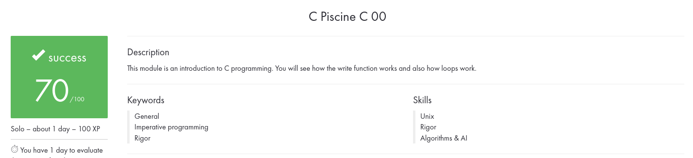

# C00

**Table of contents :**

| **N°** | **Exercises** | **A few words** |
| :---: | :---: | :--- |
| `00` | [`ex00`](./ex00/) | ft_putchar |
| `01` | [`ex01`](./ex01/) | ft_print_alphabet |
| `02` | [`ex02`](./ex02/) | ft_print_reverse_alphabet |
| `03` | [`ex03`](./ex03/) | ft_print_numbers |
| `04` | [`ex04`](./ex04/) | ft_is_negative |
| `05` | [`ex05`](./ex05/) | ft_print_comb |
| `06` | [`ex06`](./ex06/) | ft_print_comb2 |
| `07` | [`ex07`](./ex07/) | ft_putnbr |
