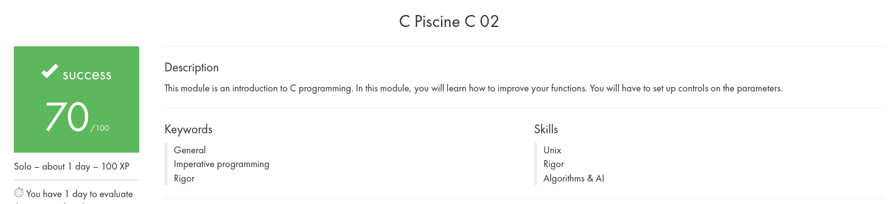

# C02

**Subjects :** [PDF](./en.subject.pdf)

**Table of contents :**

| **N°** | **Exercises** | **A few words** |
| :---: | :---: | :--- |
| `00` | [`ex00`](./ex00/) | ft_strcpy |
| `01` | [`ex01`](./ex01/) | ft_strncpy |
| `02` | [`ex02`](./ex02/) | ft_str_is_alpha |
| `03` | [`ex03`](./ex03/) | ft_str_is_numeric |
| `04` | [`ex04`](./ex04/) | ft_str_is_lowercase |
| `05` | [`ex05`](./ex05/) | ft_str_is_uppercase |
| `06` | [`ex06`](./ex06/) | ft_str_is_printable |
| `07` | [`ex07`](./ex07/) | ft_strupcase |
| `08` | [`ex08`](./ex08/) | ft_strlowcase |
| `09` | [`ex09`](./ex09/) | ft_strcapitalize |
| `10` | [`ex10`](./ex10/) | ft_strlcpy |
