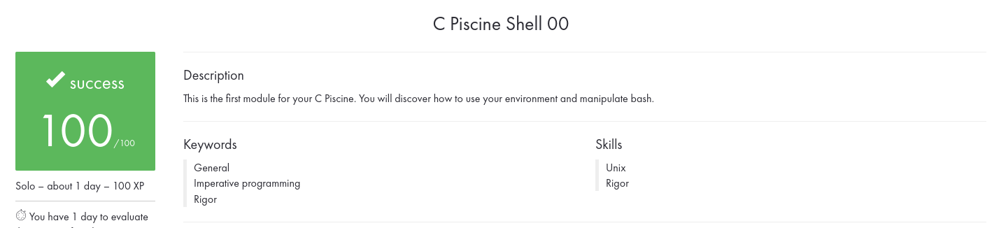

# shell00

**Table of contents :**

| **N°** | **Exercises** | **A few words** |
| :---: | :---: | :--- |
| `00` | [`ex00`](./ex00/) | Only the best know how to display Z |
| `01` | [`ex01`](./ex01/) | What are attributes anyway ? |
| `02` | [`ex02`](./ex02/) | Oh yeah, mooore... |
| `03` | [`ex03`](./ex03/) | SSH Key |
| `04` | [`ex04`](./ex04/) | midLS |
| `05` | [`ex05`](./ex05/) | GiT commit? |
| `06` | [`ex06`](./ex06/) | GiT |
| `07` | [`ex07`](./ex07/) | diff |
| `08` | [`ex08`](./ex08/) | clean |
| `09` | [`ex09`](./ex09/) | Illusions, not tricks, Michael... |
